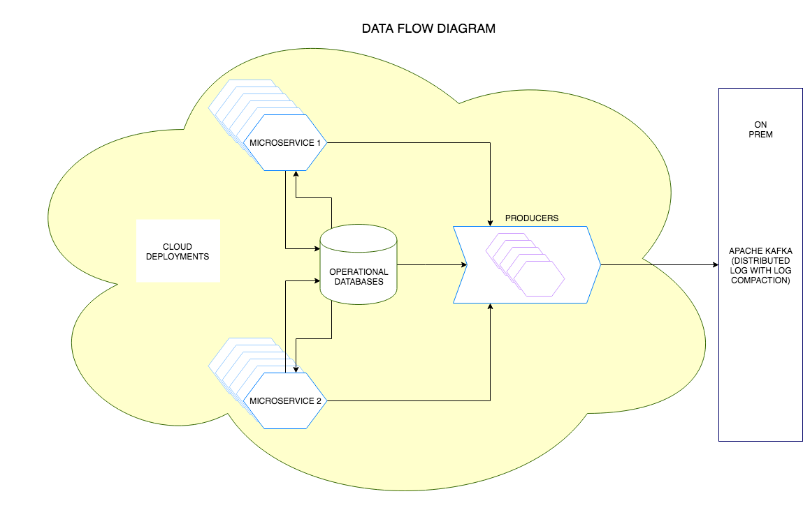

# Spring Kafka Json [Producer]() Prototype

This application is just a prototype on how we can post json messages to multiple [kafka](https://kafka.apache.org/) topics from a single REST end point.
However, every change in schema would require a new DTO (Data tansfer object to be created) which acts as a service contract between the client and the producer application.

> Note: This is just a prototype and is not yet ready for production. Operations related stuff still has to be in-corported. This can be easily achieved using springs [Actuator](https://spring.io/guides/gs/actuator-service/) project and other options provided by spring. If you are going to run this in containers would be good to include a [service registry](http://microservices.io/patterns/service-registry.html) to effectively operate the application.

## Dataflow diagram



## Prerequisites

* JDK 1.8 
* Kafka 0.9.0.0 +
* Zookeeper

## Set up process

Clone the repo and run the following to build the project

```sbtshell
cd /root/directory

mvn clean install
```

Make sure you have access to a Kafka cluster. If not please follow the instructions [here](https://kafka.apache.org/quickstart)

Once the build is sucessfull, run the following command to start the application

```sbtshell
java -jar target/*.jar
```

The application should be up and running on port 10000

> Note: You can externalize your applications config too. If you would like to make changes to the config please refer to [this](https://docs.spring.io/spring-boot/docs/current/reference/html/boot-features-external-config.html)

## How to post data?

Below is a cURL request which would help you post some data
```sbtshell
curl -X POST \
  http://localhost:10000/message/producer/customer-deposit \
  -H 'Content-Type: application/json' \
  -d '{
	"username": "user1",
	"event": "Manchester vs Liverpool",
	"stake": 50.00,
	"jurisdiction": "UK",
	"country": "UK",
	"brand": "Bet365",
	"product": "Sportsbook",
	"channel": "channel",
	"currency": "GBP"
}'
```

This would post a message to [customer-depost]() topic. 

> Note: If the topic does not exist, kafka would create it for you based on the configuration of your cluster. Its recommonded that you create the topic yourself, so that you can specify the number of partitions and the required replication factor.
